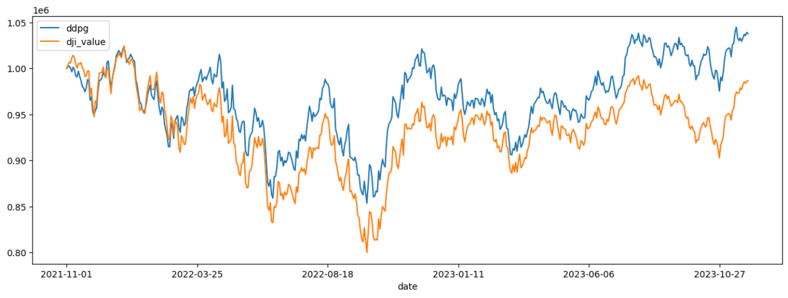

# DDPG-for-optimal-trading-strategies-in-the-stock-market
Using Deep Deterministic Policy Gradient to Obtain Optimal Strategy in the Stock Market

## Overview

This study implements a Deep Deterministic Policy Gradient (DDPG) algorithm to develop an optimal trading strategy for 30 stocks from the Dow Jones Industrial Average (DJIA). The data is collected from YahooDownloader, covering two periods: January 1, 2010, to October 31, 2021, for training, and November 1, 2021, to December 1, 2023, for evaluation.

## Data

### Historical Stock Data

The dataset includes the following columns:

- date
- open
- high
- low
- close
- volume
- tic
- day

### Technical Indicators

Technical indicators and feature engineering involve:

- macd
- boll_ub
- boll_lb
- rsi_30
- cci_30
- dx_30
- close_30_sma
- close_60_sma
- vix
- turbulence

## Market Environment

The `StockTradingEnv` simulates real market conditions with:
- Initial capital: $1,000,000
- Max shares: 100 per stock
- Transaction costs: 0.1% per trade
- Action space: Equal to the number of stocks

## Training DDPG Agents

DDPG learns a policy to manage a stock portfolio considering transaction costs, market impact, and risk factors. The training involves actor and critic networks, target networks for stabilization, and a replay buffer for storing experiences.

### Training Process

1. Adjust portfolio by buying/selling stocks.
2. Calculate new portfolio value based on stock price changes.
3. Provide reward based on portfolio performance.
4. Store experiences in the replay buffer.
5. Sample experiences to update networks.

## Results

The performance of the DDPG strategy compared to the DJIA is summarized below:

| Metric                | DDPG    | DJIA    |
|-----------------------|---------|---------|
| Cumulative returns    | 0.037790| 0.001032|
| Annual return         | 0.018034| 0.000496|
| Daily value at risk   | -0.019241| -0.020422|
| Annual volatility     | 0.153654| 0.162524|
| Sharpe ratio          | 0.193269| 0.084233|
| Stability             | 0.102843| 0.001174|

The DDPG strategy outperformed the DJIA index in higher returns and lower risk.

## Conclusion

The DDPG strategy achieves optimal portfolio allocation by maximizing returns at a set risk level and minimizing risk. Continuous monitoring and retraining are crucial to adapt to new market conditions.

